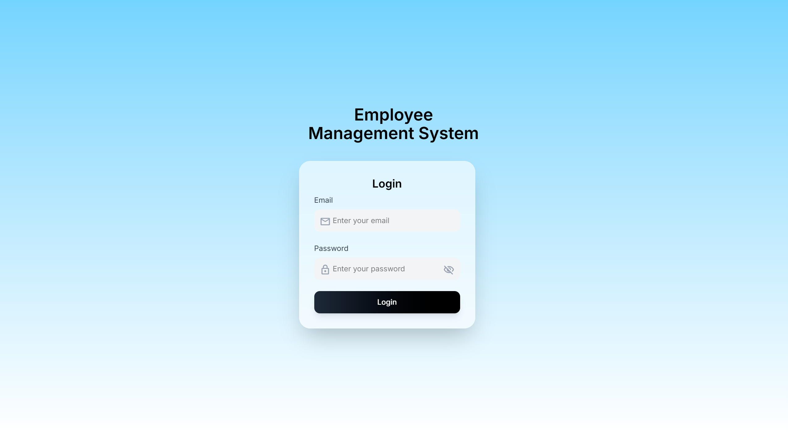
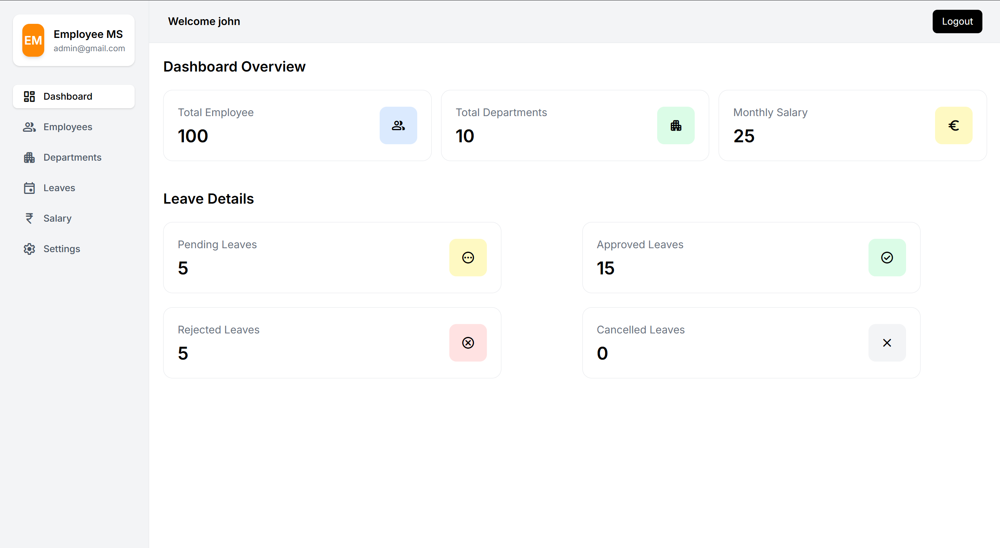

**Employee Management System (EMS)**
_A full-stack Employee Management System built using the MERN Stack (MongoDB, Express, React, Node.js) that allows organizations to manage employees, departments, roles, and attendance efficiently._

_This project demonstrates real-world SaaS architecture with authentication, role-based access control, and CRUD operations._

**Features**

- JWT Authentication (Login / Register)
- Employee CRUD (Create, Read, Update, Delete)
- Department Management
- Role-Based Access Control (Admin / Manager / Employee)
- Attendance Tracking
- Dashboard with Employee Stats
- Search & Filter Employees
- RESTful API Architecture
- Deployment Ready (Docker support optional)

**🛠️ Tech Stack**
_Frontend_

- React.js
- Axios
- React Router
- Tailwind CSS / CSS Modules

_Backend_

- Node.js
- Express.js
- MongoDB
- Mongoose
- JWT Authentication
- bcrypt (Password Hashing)

**Installation & Setup**

1. Clone the Repository
   `git clone https://github.com/.git`
   `cd EMS`
2. Backend Setup
   `cd server`
   `npm install`
3. Create a _.env_ file inside _/server_:
   `PORT=5000`
   `MONGO_URI=your_mongodb_connection_string`
   `JWT_SECRET=your_secret_key`
4. Run backend:
   `npm run dev`
5. Frontend Setup
   `cd client`
   `npm install`
   `npm start`

**Future Improvements**

- _Email Notifications_
- _Multi-Tenant SaaS Support_
- _Microservices Architecture_
- _Kubernetes Deployment_

**Screenshots**

**Author**
**Aman Phalswal**
_Aspiring Full Stack & DevOps Engineer_
